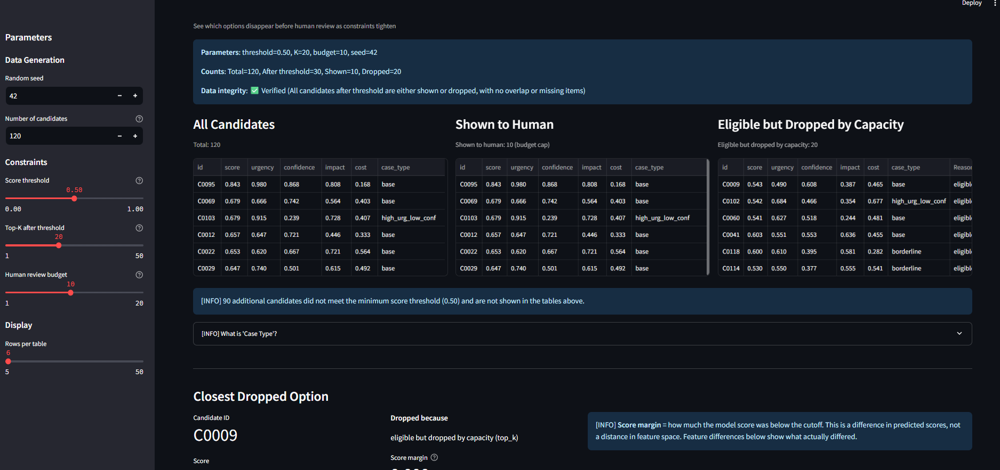

# Decision Space Visualizer

This tool visualizes how thresholds, top-K limits, and review budgets remove candidates before human review.
It informs threshold selection, review budget sizing, and top-K choice in constrained human review workflows.

A diagnostic tool that shows **which options a model removed before human review** -- and how constraints quietly collapse choice.

This project is an applied exploration of judgment-preserving system design. Many decision systems silently remove options through thresholds, rankings, or capacity constraints before a human ever sees them, creating the appearance of choice while collapsing the true decision space. The Decision Space Visualizer makes these hidden boundaries explicit by separating scoring from constraint application and surfacing which candidates are excluded — and why. It is intentionally scoped as a local, no-commit diagnostic tool using synthetic data, designed to test how judgment can be preserved when automation is used to structure decisions rather than replace them.

---
## Doctrine → Code Map

This repository applies a judgment-preserving design doctrine by making decision boundaries,
constraints, and option loss explicit. Key doctrine elements map to the codebase as follows:

| Doctrine concept | Where it appears in this repo | Why it matters |
|-----------------|--------------------------------|----------------|
| Decision boundary | `src/constraints.py: apply_constraints` | Separates scoring from constraint enforcement so option loss is explicit and inspectable |
| Judgment anchor | Streamlit UI parameters (`app.py` sidebar) | Makes constraint choices explicit and user-controlled rather than implicit defaults |
| Option visibility | UI tables + charts (`app.py`) | Surfaces which candidates were never seen by a human |
| Invariants | Assertions and tests in `src/constraints.py` and `tests/` | Ensures partitions are correct and prevents silent option loss |
| Reproducibility | Fixed seeds + parameterized runs | Allows inspection and comparison of decision-space collapse under different constraints |

## The Problem

In many real systems -- alert triage, candidate shortlisting, operational prioritization -- models do more than score options (e.g., fraud alerts, content moderation queues, targeting shortlists).

They:
- filter candidates early
- rank them under time pressure
- apply thresholds or top-K limits (keep only the top N items)
- enforce implicit review budgets

By the time a human "decides," many plausible alternatives are already gone.

Those lost options are rarely visible, logged, or discussed -- even though they shape outcomes as much as the final choice.

---

## What This Changes
This tool makes previously implicit choices inspectable:

- threshold selection
- review budget sizing
- top-K choice

---

## What This Tool Shows

Decision Space Visualizer makes this hidden step explicit.

It displays:
- all candidates initially considered
- the subset surfaced for human review
- the candidates that were **never seen**
- how close dropped options were to inclusion
- how tightening constraints changes the decision space

The focus is not prediction quality, but **option visibility**.
This tool separates model scoring from workflow constraints so non-ML readers
can see which options were removed by process design rather than model accuracy.

---

## Fork Examples

Examples of where this same analysis applies (**no code changes required**):
- content moderation queues
- fraud investigation queues
- hiring or admissions shortlists

---

## Reuse and Swap Test

What can be reused:
- Use the constraints module to analyze any ranked list with thresholds and budgets
  (e.g., a hiring shortlist or a fraud queue).
- Use the data generator to create deterministic test cases and edge conditions.

Quick swap check (under 30 minutes):
1. Replace the scoring step with a stub that returns constant scores.
2. Run `streamlit run app.py` and confirm the UI still works.
3. Swap in a new scoring function without changing the constraints module.

Inputs and outputs:
- `score_fn(candidates) -> scores`
- `apply_constraints(scores, candidates) -> kept, dropped`
- `explain(kept, dropped) -> artifacts`

---

## Default Screenshot



Shows where option loss occurs: below threshold, eligible but dropped by capacity, and shown to human.

---

## Running the App

**Prerequisites**:
- Python 3.8.10 - 3.10.x (tested on 3.8.10, 3.10.11)
- Supported platforms: Windows 10+, Ubuntu 22.04+, macOS 13+ (Intel)

**One-time setup**:
```bash
# Clone repository
git clone https://github.com/etalbert102/decision_space_visualizer.git
cd decision_space_visualizer

# Create virtual environment
python -m venv venv

# Activate
source venv/bin/activate  # Unix/Mac
# OR: venv\Scripts\activate  # Windows

# Install dependencies
pip install -r requirements.txt  # Compatibility
# OR: pip install -r requirements-lock.txt  # Reproducibility
```

**Run**:
```bash
streamlit run app.py
```

The app will open in your browser at `http://localhost:8501`.

Adjust thresholds, top-K limits, and review budgets to see how the decision space changes.

Setup time target: <= 15 minutes on a clean machine following the steps above.

---

## Installation Options

**For compatibility** (works on Python 3.11+, ARM architectures):
```bash
pip install -r requirements.txt
```

**For reproducibility** (exact same results as demos):
```bash
pip install -r requirements-lock.txt
```

**Dependency authority**:
- Contributor installs: `requirements.txt`
- Reproducible runs: `requirements-lock.txt`

Note: Lock file tested on Python 3.8.10 (Ubuntu 22.04 x86_64), 3.10.11 (Windows 10, macOS 13 Intel).
May not work on ARM architectures or Python 3.11+.

---

## Core Mechanism

1. Candidates receive model scores (fixed-coefficient logistic regression)
2. Constraints are applied sequentially:
   - Score thresholds (quality gate)
   - Top-K filtering (capacity/triage gate)
   - Review budget (attention/time gate)
3. The decision surface splits into:
   - **shown to human**: reachable by human review
   - **eligible but dropped by capacity**: passed threshold but excluded by top-K or budget
   - **below threshold**: filtered out at first stage

Dropped candidates are sorted by proximity to inclusion, making loss of alternatives legible.

---

## Why This Matters

Most discussions of human-in-the-loop systems focus on *who* makes the final call.

This tool highlights a different failure mode:

> **Human authority can remain formally intact while meaningful choice disappears upstream.**

As systems optimize for speed and throughput, judgment is not overridden -- it is constrained by what is allowed to appear.

This pattern recurs across domains wherever models compress complexity under time pressure.

---

## Non-Goals (Locked Scope)

This project intentionally does **not**:

- train or optimize models
- benchmark accuracy or recall
- provide fairness or bias audits
- offer production-ready infrastructure
- replace human decision-making

It is a diagnostic tool for decision workflows, not a product.

This will not become a production system, training pipeline, or fairness audit.

---

## Determinism and Reproducibility

**Scope**: Deterministic within same:
- Python version (3.8.10 or 3.10.11)
- Platform (Ubuntu 22.04 x86_64, Windows 10 x86_64, macOS 13 Intel)
- Pinned dependencies (requirements-lock.txt)

**Cross-platform**: Minor floating-point differences (< 1e-6) expected due to platform-specific arithmetic.

**Guarantee**: Same seed + platform + pinned deps = identical results (within tolerance).

---

## Complexity Budget

- Dependencies: pinned and minimal (Streamlit, NumPy, Pandas, SciPy)
- Runtime: UI updates < 2 seconds; performance test < 1s local / < 3s CI
- Platform scope: Windows 10+, Ubuntu 22.04+, macOS 13+ (Intel)
- Candidate cap: 500 (UI hard cap for responsiveness)

---

## Re-implementability

The conceptual core (score -> constraints -> visibility) can be rebuilt in another
stack in about one day using this README alone.

---

## Testing

```bash
# Run all tests
pytest tests/ -v

# Run with coverage
pytest tests/ -v --cov=src

# Run performance benchmark
pytest tests/test_performance.py -v

# Run validation script
python scripts/validate_distribution.py
```

**If tests fail**:
1. Check Python version: `python --version` (should be 3.8.x or 3.10.x)
2. Verify dependencies: `pip list | grep -E "numpy|pandas|scipy"` (Unix) or `pip list | findstr "numpy pandas scipy"` (Windows)
3. Clean reinstall: `pip install -r requirements-lock.txt --force-reinstall`
4. Check platform: Some tests may have minor differences on ARM (< 1e-6 tolerance)
5. If determinism tests fail: Verify using same platform as CI

**Known issues**:
- Apple Silicon (M1/M2): May have minor floating-point differences within tolerance
- Python 3.11+: Not officially supported, may have compatibility issues
- Windows: CI uses Python script for version verification (grep not available)

---

## License

MIT License - see LICENSE file

---

## Citation

If you use this tool in research or presentations:

```
Decision Space Visualizer (2026)
A diagnostic tool for option loss under constraints in ML-assisted decision systems
https://github.com/etalbert102/decision_space_visualizer
```


